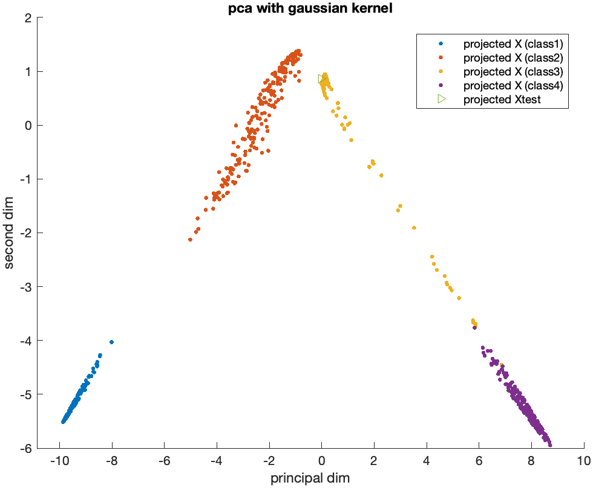

## Kernel PCA

**Nonlinear transformations**: PCA is excellent for linear correlations, but real-world data often has nonlinear relationships. Kernel PCA addresses this by implicitly projecting data into a higher-dimensional space where linear relationships might exist.

**The "kernel trick"**: It avoids directly performing this high-dimensional projection, which could be computationally expensive, by cleverly using kernel functions (e.g., Gaussian, polynomial).

    
    

### Geometric Intuition

**The Kernel Trick**: Imagine our data cannot be easily separated using a straight line in its current form. A kernel function implicitly transforms the data into a higher-dimensional space where this separation might become possible. Visualize this as "bending" the data.

**Linear PCA in the Higher Space**:  Kernel PCA essentially performs regular PCA in this transformed space. It finds directions of maximum variance (principal components) within this transformed, higher-dimensional space.

**Nonlinear Components in the Original Space**:   Due to the kernel transformation, the principal components found in the higher-dimensional space correspond to nonlinear components when projected back to the original space.

### Example (Gaussian Kernel)

**Initial Data**: Imagine a dataset with circular patterns. Linear PCA would be ineffective here.
Kernel Transformation: The Gaussian kernel implicitly projects this into a higher-dimensional space where these circular patterns might become more linearly separable.
**PCA in the Transformed Space**: Kernel PCA finds the principal components in this transformed space.
Result: When projecting back to the original space, these principal components might capture the circular structures within the original data.
Key Points

**Implicit Transformation**: We never explicitly see the high-dimensional space, but the kernel trick and subsequent PCA allow us to capture its effect on relationships in the original data.
**Choice of Kernel**: The choice of kernel function (Gaussian, polynomial, etc.) influences the nature of the transformation and the kind of nonlinear relationships Kernel PCA can discover.

### Compared to Standard PCA
**Linear vs. Nonlinear**: Standard PCA finds linear directions of variation. Kernel PCA finds nonlinear directions that correspond to linear variations in a higher-dimensional space.