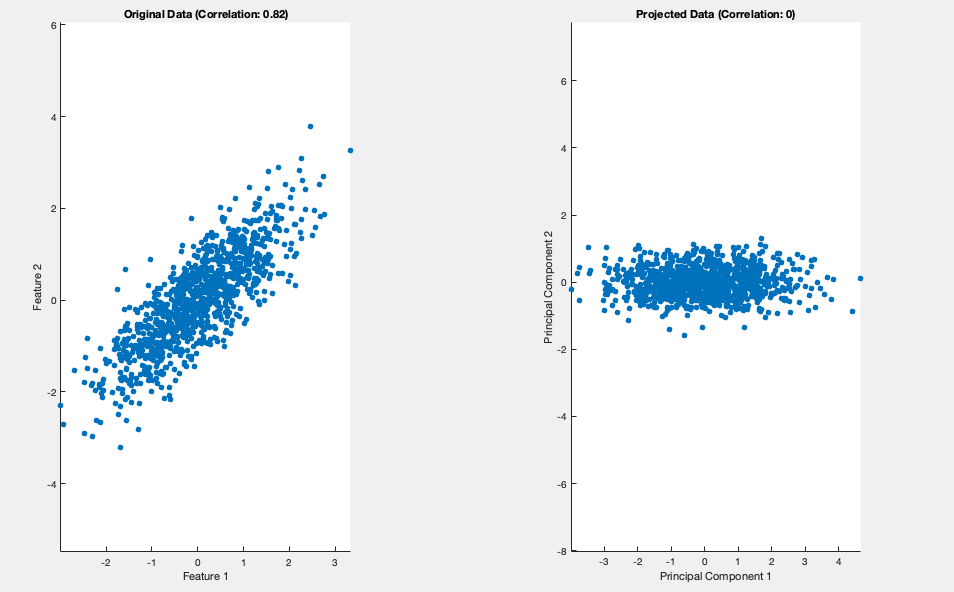
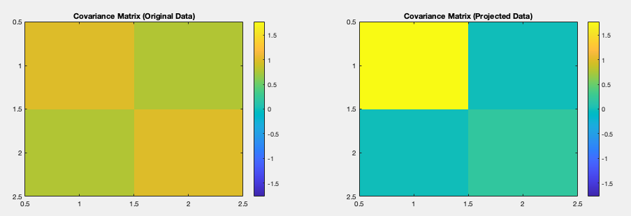

#### Aim:
- Aims to transform the original features of a dataset into a new set of **Uncorrelated variables** called **Principal Components** with the objective of retaining the most important information while discarding the least important.
  - This process effectively removes redundancy in the data and helps in simplifying the representation of the dataset.

#### Geometric Intuition: Starting with 2D

**Goal**: Find the new axes on which the transformed data would be uncorrelated.

**Data Representation**:  Imagine your correlated dataset as an elongated ellipse in a 2D space.

**Principal Components**:

- **Principal axis 1**: Represents the direction of maximum data spread (variance). This is the dominant trend within the data.
- **Principal axis 2**: Orthogonal to the first axis, capturing the remaining variance. This represents the variation that is independent of the trend captured by Principal Axis 1.

**2. PCA: Rotation and Rescaling**

- **Identify Axes**: PCA finds the ellipse's major and minor axes. These become the new principal component axes.
- **Rotation**: PCA rotates the coordinate system to align with these new axes, effectively removing the initial correlation.
- **Rescaling**: PCA might rescale the axes for standardization purposes.

**3. The Uncorrelated Result**

- After projecting the data onto the rotated axes, the spread along each new axis is independent. This removes correlation, as the new axes represent the natural directions of maximum and minimum variation. 

**Key Points**

- **Elongation**: The shape of the ellipse indicates the strength of the original correlation. A highly elongated ellipse means a strong correlation.
- **Dimensionality Reduction**: In practice, the first few principal components often capture most of the variation, allowing you to reduce the dimensionality of your data.
